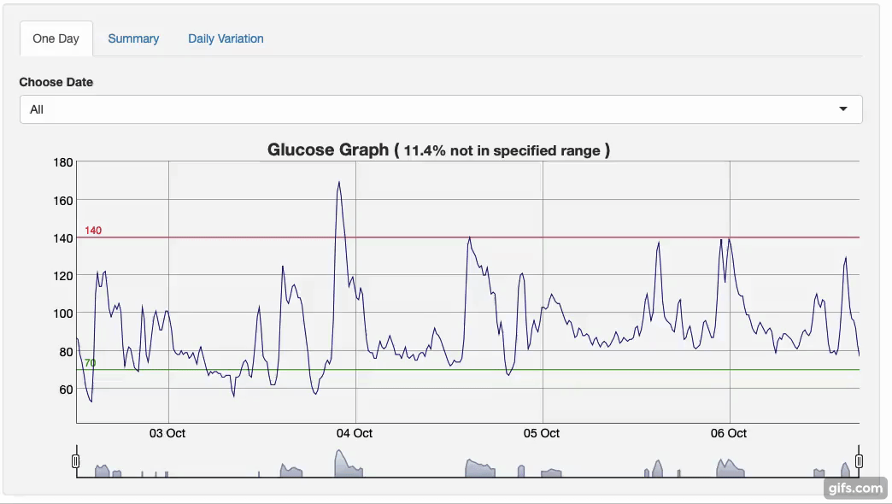
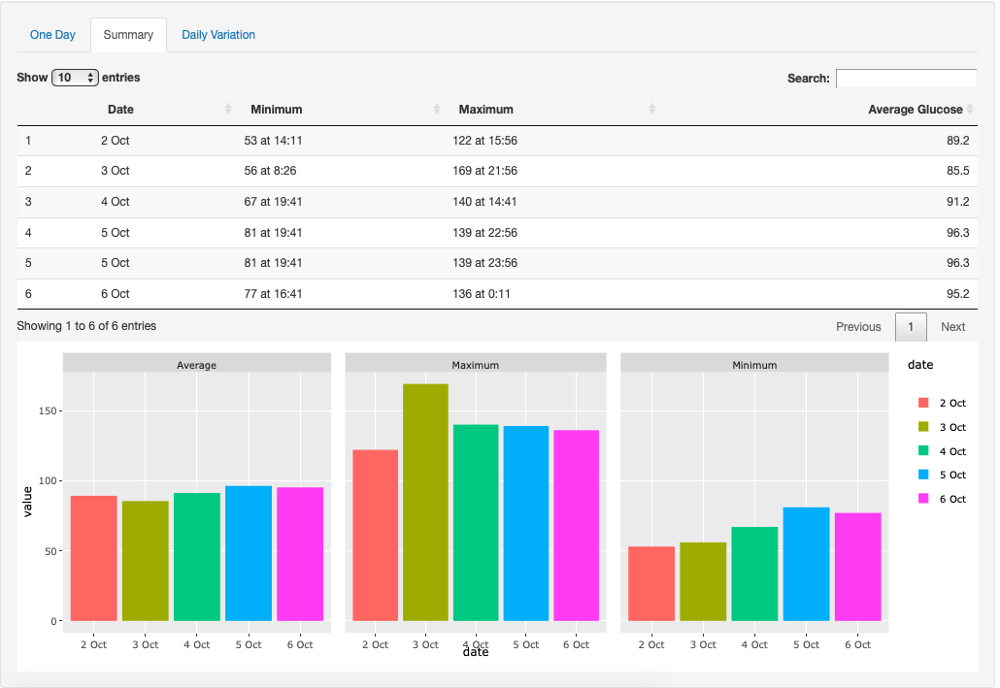
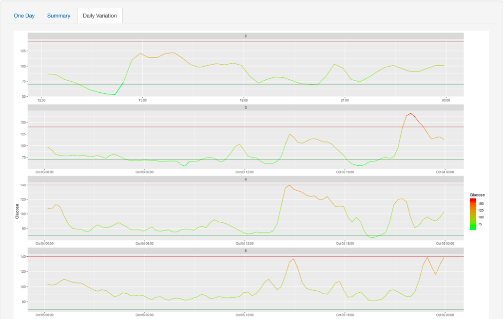

# Glucose Monitoring

This app creates reports out of data generated from Abbott's Freestyle Glucose Measuring Devices.

App Link - https://shreykhetrapal.shinyapps.io/glucose_monitoring/

*Please check out sample text files to use with the app*

# Features

## All Data Visualisation

## Summary 

Detailed summary of highs and lows of each day.

## Daily Variation

Daily charts comparison of days

## Support 

- Freestyle Libre Pro Flash Glucose Monitoring System
- ".txt" files as generated by the sensor
